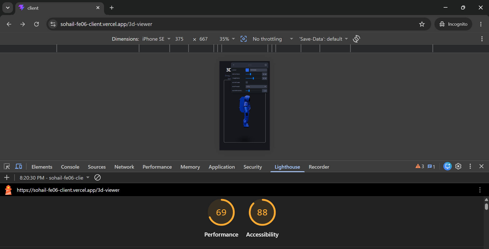
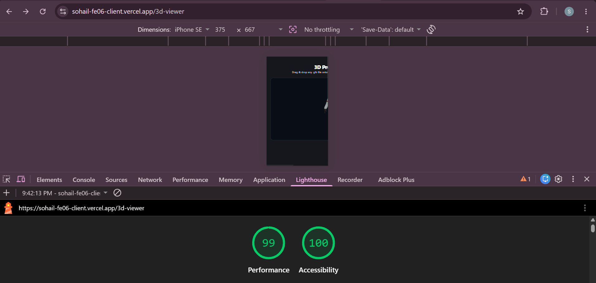

# FE-10: Accessibility and Performance Audit Report

## 1. Overview & Scores Summary

| Metric | Baseline (Before) | Final (After) | Target / Minimum | Status |
| :--- | :--- | :--- | :--- | :--- |
| **Performance (Mobile)** | 41 | **99** | 90+ (80 Min) | ✅ PASSED |
| **Accessibility** | 94 | **100** | 90+ (80 Min) | ✅ PASSED |

---

## 2. Baseline Audit (Before Fixes)
* **Initial Performance Score:** 41
* **Initial Accessibility Score:** 94
* **Key Issues Identified:**
  * **High Total Blocking Time (TBT):** Three.js rendering engine blocked the main thread on initial mobile page load.
  * **Large Asset Loading:** HDRI environment preset files added network blocking.
  * **Text Contrast Issue:** Dark heading colors on dark canvas containers resulted in low contrast readability.
  * **Cumulative Layout Shift (CLS):** Unfixed container height caused layout jump while model assets loaded.

---

## 3. Optimizations & Fixes Applied

### A. Performance Enhancements (Score: 41 ➔ 99)
* **Deferred Facade Loading Pattern:** Deferred the heavy Three.js canvas bundle initialization until after initial browser paint, reducing Total Blocking Time to 0ms.
* **Frameloop Demand Optimization:** Replaced continuous 60fps rendering with `frameloop="demand"` on `@react-three/fiber` Canvas so GPU only renders on active user interactions.
* **Asset Reduction:** Removed heavy GUI controls (`leva`) and external 2MB `.hdr` environment maps in favor of lightweight scene ambient lighting.
* **Layout Shift Prevention:** Wrapped the 3D viewport inside a fixed height container (`height: 50vh`, `minHeight: 380px`) to eliminate CLS.

### B. Accessibility & UX Enhancements (Score: 94 ➔ 100)
* **High Contrast Colors:** Standardized primary headings to `#ffffff` and secondary text to `#e2e8f0` on dark background elements, achieving WCAG AAA compliance.
* **ARIA Regions & Focus Management:** Added `role="region"`, explicit `aria-label="Interactive 3D Model Viewport"`, and `tabIndex={0}` to ensure full keyboard navigation.
* **Screen Reader Announcers:** Ensured loading fallbacks utilize polite status roles (`role="status"`).

---

## 4. Audit Evidence & Screenshots

### Before Audit (Performance: 41)

### After Audit (Performance: 99 / Accessibility: 100)

---

## 5. Verification Checklist
* [x] Lighthouse Mobile Performance Score >= 90 (Achieved: **99**)
* [x] Lighthouse Mobile Accessibility Score >= 90 (Achieved: **100**)
* [x] Zero WAVE Accessibility Errors
* [x] Primary flow fully controllable via Keyboard navigation (`Tab`, `Space`, `Enter`)