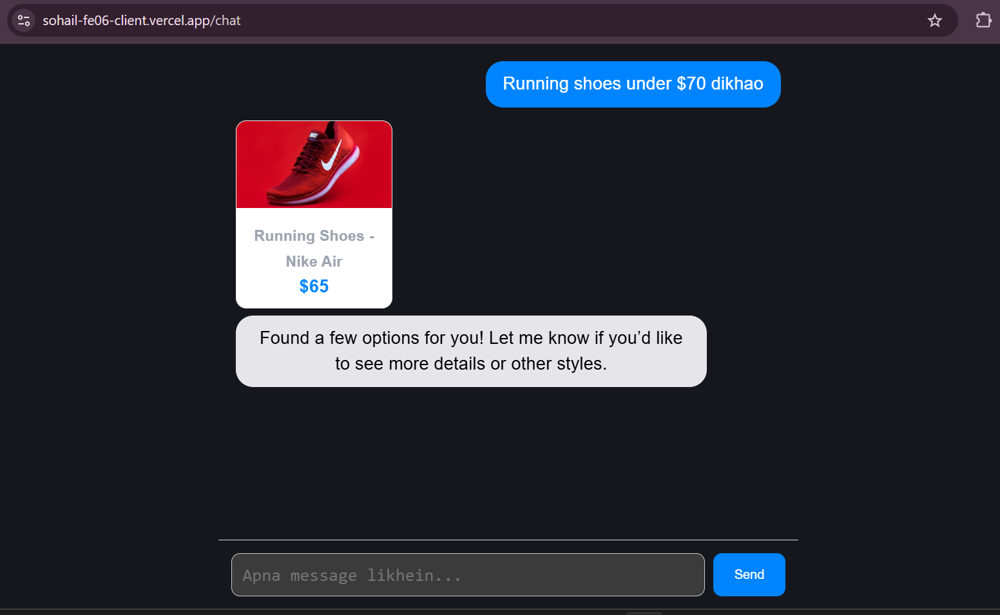
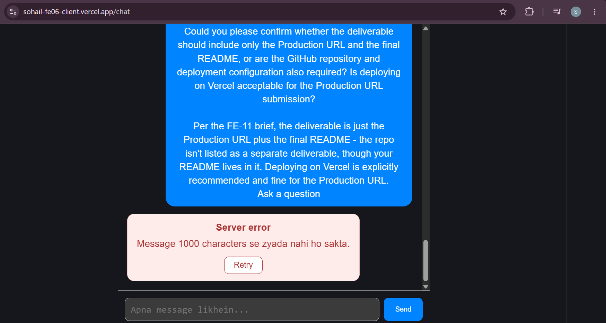

# SOHAIL — MERN Ecommerce (AI Shopping Assistant)

Dark streetwear ecommerce site, rebuilt as a full MERN-stack app with a chat-first AI shopping assistant. Originally a static HTML/CSS/JS storefront; this repo is the full-stack rebuild.

**Live app:** https://sohail-fe06-client.vercel.app/chat
**API:** https://sohail-fe06-server.vercel.app

## What it does / who it's for

A shopping assistant chat interface — instead of browsing category pages, a shopper describes what they want ("running shoes under $70") and the assistant searches the catalog and returns results as cards, inline in the conversation. Built as a Flyrank Frontend AI Engineering capstone to demonstrate a *meaningful* AI integration (tool-calling with a real lifecycle and error states), not a chatbot that just echoes text back.

## Stack

| Layer    | Tech                          |
| -------- | ------------------------------ |
| Frontend | React (Vite)                   |
| Backend  | Node.js + Express               |
| AI model | Groq (`openai/gpt-oss-120b`), tool-calling |
| Deployment | Vercel (client + server, separate serverless deployments) |

> **Note:** `mongoose`/`mongodb`/`jsonwebtoken` are in `server/package.json` from an earlier auth/DB scaffold, but the current chat flow does **not** touch a database — `searchProducts` reads from an in-memory mock catalog (`server/tools/searchProducts.js`). Wiring the real product catalog to MongoDB Atlas is listed under Known Limitations below.

## Run it locally

Two servers, run in separate terminals.

```bash
# 1. Server (from /server)
cd server
npm install
npm run dev        # or: node index.js  — starts on http://localhost:5000

# 2. Client (from /client)
cd client
npm install
npm run dev         # Vite dev server, http://localhost:5173
```

The client auto-points at `http://localhost:5000/api/chat` in dev mode and at the deployed server URL in production — no client-side env var needed for this.

### Environment variables (`server/.env`)

| Variable | Required | Purpose |
|---|---|---|
| `GROQ_API_KEY` | Yes | Groq API key — powers the chat model and tool-calling |
| `CLIENT_ORIGIN` | Yes | Allowed CORS origin (your client URL, e.g. `http://localhost:5173` in dev) |
| `PORT` | No | Server port, defaults to `5000` |
| `NODE_ENV` | No | Set to `production` on deploy — disables the `?simulate=` sabotage-test switch (see below) |

## Architecture

```
┌──────────────┐        POST /api/chat (SSE)        ┌───────────────────┐
│  React client │  ─────────────────────────────────▶ │  Express server    │
│  ChatPage.jsx │                                     │  routes/chat.js    │
│  ToolCard.jsx │  ◀───────────────────────────────── │                    │
└──────────────┘     streamed events (tool-start,     └─────────┬──────────┘
                      tool-input, tool-result,                  │
                      text chunks)                              ▼
                                                        ┌───────────────────┐
                                                        │   Groq (LLM)       │
                                                        │  openai/gpt-oss-  │
                                                        │  120b + tool call  │
                                                        └─────────┬──────────┘
                                                                  │ tool_calls
                                                                  ▼
                                                        ┌───────────────────┐
                                                        │ searchProducts()   │
                                                        │ (mock catalog)     │
                                                        └───────────────────┘
```

- **Client → Server:** `ChatPage.jsx` POSTs the message history to `/api/chat` and reads back a Server-Sent Events stream.
- **Server → Groq:** the server makes a non-streaming first-pass call with `tools: [searchProducts]` to see if the model wants to call the tool.
- **Tool lifecycle:** if the model calls `searchProducts`, the server streams four distinct states to the client, rendered by `ToolCard.jsx`:
  1. `input-streaming` — skeleton/pulsing placeholder while the model builds the search arguments
  2. `input-available` — spinner while the tool executes, showing the search query
  3. `output-available` — results rendered as a product card grid (image, name, price)
  4. `output-error` — a designed red error card (e.g. "no products found"), not a crash
- **Why SSE instead of a single JSON response:** the tool-call lifecycle (searching → results) needs to be visible to the user as it happens, not just as a final blob.

## AI integration — the `searchProducts` tool

**Schema:**
- `query` (string, required) — product name or category keyword
- `maxPrice` (number, optional) — max price filter in USD

**Returns:** up to 5 `{ id, name, price, category, image }` objects. Throws if nothing matches, which the client renders as `output-error`, never a raw crash.

**Why this design:** the goal was to prove the AI does something *useful* (a grounded catalog search with a real UI state machine) rather than a text box that just relays model output. The prompt (`server/config/aiConfig.js`) explicitly tells the model not to repeat search results as text since they're already shown as cards — that was a real fix after an early version had the model re-listing results underneath the cards.

## How AI tools built this

This project used Claude Code and Cursor throughout, and one workflow drill (FE-03, full writeup in `WORKFLOW.md`) is worth summarizing honestly here rather than just claiming "AI helped build this":

Built the same feature (a user settings form) twice — once with a one-line vague prompt accepted as-is, once with a precise prompt (plan mode, explicit file references, a "write tests and verify" step). The vague round produced something that *looked* done in under a minute but only had `required`-attribute validation — no email/phone format checks, no confirm-password field. The precise round added real validation, `aria-invalid`/`aria-describedby` wiring for screen readers, and 8 named test cases.

**One gap survived in both rounds:** neither AI pass added server-side email/phone validation in `userController.js` — both only trim and lowercase input. Client-side validation alone doesn't stop a direct API call, and that's a real limitation still in this codebase (see below).

**One AI mistake caught in review:** a prompt referenced a file (`@src/pages/Signup.jsx`) that doesn't exist in this repo — instead of guessing or inventing a file, the agent stopped and asked which file to use as the reference pattern.

## Testing

- **Unit/component (Vitest + React Testing Library):** `ChatPage.jsx` (14 tests — empty state, input validation, pending/streaming states, all error kinds, retry flow) and `ToolCard.jsx` (6 tests — all four tool lifecycle states). Queries use role/label/text, not test IDs. The AI route is fully mocked; no test calls the real API.
- **End-to-end (Playwright):** covers the primary chat flow plus a retry-after-failure flow.
- **CI:** GitHub Actions runs both suites on every push and blocks merging on failure.
- Run locally: `cd client && npm run test` (Vitest) and `npm run test:e2e` (Playwright).

## Screenshots






## How it fails safely

| Failure | Handling |
|---|---|
| Empty message | Rejected client- and server-side before a stream even opens (`400`) |
| Message > 1000 characters | Rejected server-side (`400`) — stops prompt-stuffing / token waste |
| Too many requests | Rate-limited to 15 requests/min per IP (`express-rate-limit`); returns `429` |
| Network drop mid-stream | `ErrorBoundary` + retry affordance in the UI instead of a blank/broken screen |
| Malformed stream chunk | Client skips the bad chunk instead of crashing the render |
| Tool finds nothing | Rendered as a designed `output-error` card, not a stack trace |
| Long-running request | `maxDuration: 30` set on the Vercel serverless function so it can't hang indefinitely |

These were built and sabotage-tested in FE-08 (network fail, mid-stream fail, `429`, malformed JSON, empty state all deliberately triggered via a dev-only `?simulate=` switch, disabled outright when `NODE_ENV=production`).

## Deployment

- **Client:** Vercel, auto-deploys from `main` → https://sohail-fe06-client.vercel.app
- **Server:** Vercel serverless function, auto-deploys from `main` → https://sohail-fe06-server.vercel.app
- **Rollback plan:** both are standard Vercel auto-deployments from `main`. To roll back: either `git revert` the bad commit and push (triggers a redeploy), or use the Vercel dashboard → Deployments → pick the last known-good deployment → "Promote to Production". No manual infra to touch.
- **Monitoring:** no dedicated monitoring service wired up yet — Vercel's own deployment/function logs are the current visibility (see Known Limitations).

## Known limitations & future improvements

- Product catalog is an in-memory mock array, not the MongoDB Atlas database the dependencies suggest — next step is wiring `searchProducts` to a real `Product` collection.
- No server-side email/phone format validation on the (separate, non-chat) settings form — a gap that survived AI-assisted development in both prompting styles tried (see `WORKFLOW.md`).
- No dedicated uptime/error monitoring (e.g. Sentry, UptimeRobot) — currently just Vercel's built-in logs.
- Home page (`/`) is a placeholder stub; the app is intentionally chat-first for this capstone, so product-browsing pages don't exist yet.

## Conventions

- Functional React components and hooks only
- `async/await`, no `.then` chains
- Conventional Commits (`feat`, `fix`, `docs`, `chore`, `refactor`)
- Branches: `feature/<name>`, `fix/<name>`

## License

MIT — see [LICENSE](./LICENSE).